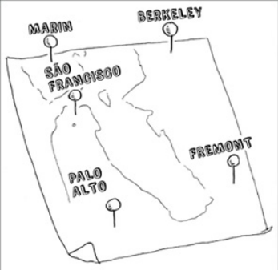

### Ele é um problema famoso da ciência da
### computação, pois seu crescimento é apavorante e algumas pessoas muito
### inteligentes acreditam que ele possa ser melhorado. Esse algoritmo é
### chamado de “o problema do caixeiro-viajante”.

### _______________________________________________________________________
### Você tem um caixeiro-viajante.
### O caixeiro precisa ir a cinco cidades.

